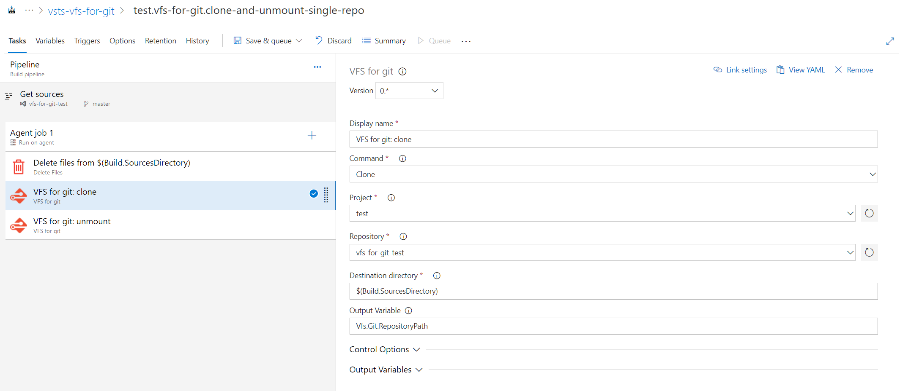

## VFS for git tasks

VFS for git is an open source system that allow you to work with huge git repositories. It was created by Microsoft to support the code base for Windows which is roughly 300 GB big and contains about 3.5 million files. See [Git at scale](https://docs.microsoft.com/en-us/azure/devops/learn/git/git-at-scale) and [gvfs.io](https://gvfs.io) for more information. The sources for VFS for git can be found on [github](https://github.com/Microsoft/VFSForGit).

This extension brings VFS for git to your build and release. By default VFS for git is not yet supported in the VSTS `Get Sources` task. But if you have large git repositories you need to work with and you do not need to download the entire repository on the build server this extensions will help you do just that!

The following articles give some more background on why and when VFS for git is usefull:

- [Technical Scale Challenges with Git](https://docs.microsoft.com/en-us/azure/devops/learn/git/technical-scale-challenges)
- [Git at Scale](https://docs.microsoft.com/en-us/azure/devops/learn/git/git-at-scale)
- [Git Virtual File System Design History](https://docs.microsoft.com/en-us/azure/devops/learn/git/gvfs-design-history)

### Minimum supported environments

- At this moment the agent must be a Windows machine.
- [VFS for git](https://github.com/Microsoft/VFSForGit) must be installed on the build agent. ([download](https://github.com/Microsoft/VFSForGit/releases/latest))
- [Git Credential Manager for Windows](https://github.com/Microsoft/Git-Credential-Manager-for-Windows) must be installed on the agent and configured as credential helper in git.

### Quick steps to get started

When using VFS for git on an agent there are basically 3 steps you need to take:

1. Before you clone, make sure the target directory is empty
2. Clone using `gvfs.exe`. This will automatically mount VFS for git enlistment.
3. As the last step unmount the VFS for git enlistment using `gvfs.exe` (release the files).

#### Setup your build

1. Make sure VFS for git is installed on your agent ([download](https://github.com/Microsoft/VFSForGit/releases/latest))
2. Create a new build
3. Disable build directory cleaning

4. Disable source syncing in the `Get Sources` task

5. Add the `Delete Files` task and configure it to clean the `$(Build.SourcesDirectory)` (assuming you will clone your VFS for git repository into this directory).

6. Add the `VFS for git` task to your build and configure it to use the `Clone` command.

    1. Select the `Clone` command
    2. Select the project
    3. Select the repository
    4. Select the directory where the repository must be cloned to. (default: `$(Build.SourcesDirectory)`)
    5. Provide a VSTS variable name where the path to the repository will be stored (default: `Vfs.Git.RepositoryPath`).

7. Add any other build steps you need. Note that the root of your repository is in a special `src` subfolder. So use the output variable set in the previous step to access your sources.

8. Add the `VFS for git` as on of the lasts tasks to your build and configure it to use the `Unmount` command. Make sure you do not need the contents of the repository after this step. Make sure you configure this taks to run always even if the build was canceled to unsure the VFS for git enlistments are properly unmounted.

### Known issue(s)

- None

### Learn More

The [source](https://github.com/sanderaernouts/vsts-vfs-for-git-tasks) to this extension is available. Feel free to take, fork, and extend.

### Feedback

- Add a review below.
- Create an issue [here](https://github.com/sanderaernouts/vsts-vfs-for-git-tasks/issues)
- Submit a Pull request [here](https://github.com/sanderaernouts/vsts-vfs-for-git-tasks)